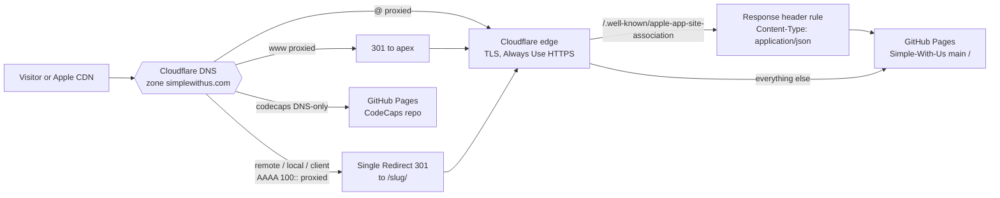

# simplewithus.com — Design Brief

**For:** MM (MiniMax), who owns this lane and iterates from here.
**From:** CLAUDE, Fri, Sep 25, 2026 (Central Time).
**Status:** proposal plus a working prototype in this PR.  Nothing here is live until MM merges it.

This brief picks one direction out of three concepts and grafts the best parts of the other two onto it.  The winner is **Developer / Open-Source First**: a data-driven catalog of real repos, with install and source links as first-class content.  It is the most mechanical to build, it has the least copywriting, and it keeps working as apps are added.  From **The Catalog** it takes CI enforcement, exact CTA rules, the takeover fix, the image budget, and the accessible card pattern.  From **Brand Story First** it takes the content-accuracy audit as a hard prerequisite, the App Store Connect URL warning, the TLS hardening sequence, and the honest-claims rule.

Everything marked *verified* was checked on Sep 25, 2026 against live DNS and HTTP, the Cloudflare zone export, `origin/main` of each app repo, and the GitHub API.  Where the verified facts disagree with Slack or with an earlier concept, the verified facts win, and the disagreement is called out.

---

## 1. What is live today (verified)

| Surface | Today | How |
|---|---|---|
| `https://simplewithus.com/` | 200, "Simple With Us -- Tools That Work Alongside You", a 10-card grid | Cloudflare **proxied** apex CNAME (flattened) to `jaywedgeworth22.github.io`.  GitHub Pages legacy build from `main` `/`, `CNAME` = `simplewithus.com`, `https_enforced: false`. |
| `http://simplewithus.com/` | 200 over plain HTTP | "Always Use HTTPS" is off.  Zone SSL mode is **Full** (not strict). |
| `https://www.simplewithus.com/` | 301 to the apex | Proxied CNAME `www` to `simplewithus.com`. |
| `/<slug>/` and `/<slug>/support.html` | 200 for 10 apps | Same repo.  The `/apps/` prefix was dropped in `e91581a`.  `*-mac/` folders are meta-refresh stubs to `/<slug>/#mac`. |
| `https://codecaps.simplewithus.com/` | 200, `server: GitHub.com`, "CodeCaps — Watch Every AI Subscription From The Menu Bar" | **Explicit** DNS-only CNAME to `jaywedgeworth22.github.io`, served by the **CodeCaps** repo's own Pages (workflow build, `cname: codecaps.simplewithus.com`). |
| `harness.`, `local.`, `client.`, `remote.`, `usage.`, and any other label | Resolve to GitHub, 404 over HTTP, TLS fails | **Not five explicit records.**  The zone has one **wildcard `*` CNAME** (DNS-only) to `jaywedgeworth22.github.io`, and no Pages site claims these names.  They are dangling. |
| `/.well-known/apple-app-site-association` | 404 | No file.  `.nojekyll` is already at the repo root, so the dot-folder will publish once the file exists. |
| Mail | iCloud (`mx01`/`mx02.mail.icloud.com`, SPF, `apple-domain=` TXT) | No DMARC record.  The wildcard also answers `_dmarc` with a CNAME to github.io. |

**Correction to the judging notes.**  The judges scored The Catalog down for "inventing a wildcard `*` CNAME".  The zone export (`simplewithus.com`, Cloudflare account *Usage.Jays.Services*, Free plan) shows the wildcard is real: records are `@` (proxied), `www` (proxied), `codecaps` (DNS-only), `*` (DNS-only), `sig1._domainkey`, two MX, and three TXT.  Slack's "harness now CNAMEs to github.io" is the wildcard answering, not a new record.  The Catalog's DNS diagnosis was right, and section 6 follows it.

Other live findings that shape the plan:

- The apex ships about 4.3 MB of app icons (`st.png` 1.0 MB, `ar.png` 942 KB, `dd.png` 797 KB, and more), plus a 3.9 MB `swu-logo-wide.svg` and a 1.4 MB `.webp` in the repo.
- Every per-app page loads Inter from Google Fonts, which is the only third-party request.
- None of the 13 Apple IDs in `~/apps/ios-fleet/apps.json` resolve on the public App Store lookup today, so no App Store button can be shown yet.
- `MiniMax-ios` is a **private** repo, so the live MiniMax Remote page's GitHub link 404s for visitors.

## 2. Positioning

- **Headline:** `Open Tools, Built in Public`
- **Sub-line:** "Simple With Us is a small catalog of apps for AI coders, markets, and everyday Mac and iPhone chores.  Most of them are open source, and every card says exactly how you can get the app today."
- **Facts line (generated):** `12 apps · 11 with public source · Apache-2.0`.  It is computed from the data, so it can never overclaim.  "Every app is open source" would be false while MiniMax Remote's repo is private.
- **Voice:** plain, specific, no superlatives.  Sentence case for body and values, Title Case for headings, buttons, nav, and `<title>`.  No `--` dashes in copy.
- **Wordmark:** `Simple With Us` with one `>` prompt caret in the accent color, in the header only.  The existing PNG logo stays for Open Graph images.

**Honest-claims rule (graft from Brand).**  Only state what is true for every app it covers, and link each claim to its proof: a repo, a privacy notice, or a store record.  A claim that cannot be linked is cut.  The "How This Catalog Stays Honest" section on the apex is this rule, made visible.

## 3. Sitemap

```
simplewithus.com/
├── /                       catalog: hero, generated grid, "How This Catalog Stays Honest", "Build From Source", footer
├── /<slug>/                one page per app, from _template/ (paths stay exactly as they are today)
│   └── support.html        per-app support.  NEVER moves: App Store Connect points here.
├── /support.html  /privacy.html  /terms.html      unchanged
├── /.well-known/apple-app-site-association         served as JSON, never linked
├── /apps/index.json        the catalog data (public, also useful to other tools)
└── /assets/                site.css, app-icons/, logos/, favicon.svg

Later, optional (PR 3):
├── /changelog/             generated from GitHub Releases by a scheduled Action
└── /self-host/             shared prerequisites, links into each repo README
```

**Shelves (graft from Catalog).**  Every app in `apps/index.json` carries a `shelf` (`ai-coders`, `markets`, `utilities`, titled "For AI Coders", "For Markets", "Everyday Utilities").  The grid stays flat while there are fewer than about 15 apps.  Past that, render one grid per shelf from the same data, with no copy changes.

## 4. Visual system

Tokens live in `assets/site.css`.  The site follows the OS appearance: light is the fallback, and dark comes from `prefers-color-scheme`.  This matches the owner ruling of 2026-09-19 in `FLEET-UI-COPY.md` (default is system; marketing captures stay light).  A future toggle sets `data-theme="light"` or `data-theme="dark"` on `<html>`, and the CSS already honors both.

| Token | Light | Dark |
|---|---|---|
| `--bg` | `#ffffff` | `#0b0e14` |
| `--bg-raised` (cards) | `#f6f7f9` | `#131722` |
| `--bg-sunken` (pills, icon wells) | `#eef0f3` | `#0f131b` |
| `--border` | `#e2e5e9` | `#232838` |
| `--border-strong` | `#c9ced6` | `#343b50` |
| `--text` | `#14171a` | `#e6e9ef` |
| `--text-muted` | `#525c67` | `#9aa4b2` |
| `--accent` (links, primary button) | `#1d4ed8` | `#7ab4fb` |
| `--accent-hover` | `#1e40af` | `#a5cdfd` |
| `--accent-contrast` (text on accent) | `#ffffff` | `#0b0e14` |
| `--focus` | `#2563eb` | `#93c5fd` |
| `--code-bg` / `--code-text` | `#0f172a` / `#e2e8f0` | `#05070c` / `#d7e0ea` |
| `--ok` / `--beta` / `--source` (status dots) | `#047857` / `#a16207` / `#475569` | `#34d399` / `#fbbf24` / `#a3b1c4` |

- **Type:** system stack only, no web font.  `--font-sans: -apple-system, BlinkMacSystemFont, "Segoe UI", system-ui, Roboto, "Helvetica Neue", Arial, sans-serif` and `--font-mono: ui-monospace, "SF Mono", SFMono-Regular, Menlo, Consolas, monospace`.  Scale: 0.875, 1, 1.125, 1.375 rem, and a fluid `clamp(1.75rem, 1.2rem + 2.4vw, 2.75rem)` for `h1`.  Mono is for commands, bundle ids, versions, and status lines.
- **Space:** 4 px base, `--space-1` to `--space-8` = 4, 8, 12, 16, 24, 32, 48, 64.
- **Shape:** radius 6 px (buttons), 12 px (cards), 22% (app icons).  Page width 1120 px, prose measure 68ch, side gutter 16 px on phones and 32 px from 720 px up.
- **Per-app color:** only a 3 px top border on each card (`--card-accent`, from the app's `accent` field, seeded from `fleet-apps.json` `digestColor`).  The umbrella palette stays neutral so twelve brand colors never fight.
- **Motion:** card lift 2 px with a 120 ms ease-out shadow, and the Copy button's label swap.  Both are disabled under `prefers-reduced-motion: reduce`.

**Contrast (WCAG AA).**  Body text and muted text pass 4.5:1 on every background in both themes (`--text-muted` light is `#525c67` on `#f6f7f9`, about 6.4:1; dark `#9aa4b2` on `#131722`, about 7:1).  The light accent `#1d4ed8` on white is about 6.7:1.  Re-check any new token with a contrast checker before shipping.

## 5. Catalog data and the per-app template

### 5.1 `apps/index.json` (the single source of truth)

Top level: `schema`, `updated`, `teamId` (`CC8UTF7ATG`), `appStoreProviderToken` (null until the owner supplies it), `apps[]`, `shelves`, and `unlisted[]` (Personal-Site, congress-trading-shared, and ai-fleet-coordinator, each with the reason it is not a card).

Required per app:

| Field | Meaning and rule |
|---|---|
| `slug` | URL segment.  Matches the existing folder name exactly. |
| `name` | Display name, exact brand casing. |
| `tagline` | One or two sentences, sentence case, two ASCII spaces between sentences (the generator converts them to U+00A0 plus a space).  Must match the repo description or the app's own site. |
| `shelf` | `ai-coders`, `markets`, or `utilities`. |
| `platforms` | Any of `iOS`, `macOS`, `Android`, `Web`. |
| `status` / `statusText` | `live`, `beta`, or `source`, plus a short sentence-case label such as "Private beta" or "App Store record pending". |
| `icon` | Path under `/assets/app-icons/`, at most 200 KB (128 px PNG or SVG). |
| `accent` | Hex color for the card's top border. |
| `page` / `support` | Paths in this repo, or null.  The build fails if a non-null path does not exist. |
| `links.website` | The app's own site, or null. |
| `links.github` | Public repo URL, or null for a private repo. |
| `links.appStore` | `https://apps.apple.com/app/id<appleId>` only once the listing is public, else null. |
| `links.testFlight` | A **public invite** `https://testflight.apple.com/join/<code>`, else null.  Bare `https://testflight.apple.com/` is rejected. |
| `links.brew` | `brew install …` once a tap exists, else null.  No tap exists today. |
| `bundleIds` / `appleIds` | Identifiers, for the AASA file and the store-link audit. |
| `associatedDomains` | True only when the app's entitlements declare `applinks:simplewithus.com`.  The build fails if such an app is missing from the AASA file. |

### 5.2 CTA rules (graft from Catalog)

- Render a CTA **only** when its backing field is non-null.  Never render a "Coming Soon" link that goes nowhere.
- If a not-yet-public button must appear, it is `<a role="link" aria-disabled="true">` with **no `href`**, styled at 55% opacity.
- App Store links carry campaign tokens: `?pt=<appStoreProviderToken>&ct=swu-<slug>-card` on the catalog and `ct=swu-<slug>-hero` on the app page, so App Store Connect can attribute installs.
- Mac downloads show version, bundle id, and SHA-256 inside a `<details>` block under the button.
- TestFlight uses the public invite link only.  Invite-only betas say "Private beta" in the status line instead.

### 5.3 Card pattern (accessibility graft)

The app name in each card is the one primary link, stretched over the whole card with `::after { position: absolute; inset: 0 }`.  Secondary links (Website, Source, Support, store) sit in `.card-links` with `position: relative; z-index: 1`, so they stay clickable above the overlay and nothing interactive is nested.  External links get `rel="noopener"` and a `↗` marked `aria-hidden`.  Icons in cards use `alt=""` because the name sits next to them.  If filter chips are added later, they use `aria-pressed`, and the result count lives in an `aria-live="polite"` region.

### 5.4 Per-app template (`_template/index.html`)

Copy to `/<slug>/` and fill from the app's data entry.  Order:

1. Header (wordmark, All Apps, Support, Privacy).
2. Hero: icon (96 px), name as `h1`, tagline, platform pills, status line.
3. CTA row, following 5.2.
4. What It Does: two or three sentences from the repo README's first paragraph.
5. Install: a code block with a Copy button (brew, or `git clone`).
6. Build Details `<details>`: version, bundle id, SHA-256.
7. Screenshots: one to three real screenshots captured on a light Mac, WebP or AVIF, each under 150 KB.
8. Optional `#mac` section.  Keep the anchor wherever an App Store Connect record or an old `/<slug>-mac/` stub points at it.
9. Privacy and Support: what leaves the device, then the feedback address and `support.html`.
10. Attribution block (required by `AGENTS.md`): "{Name} is developed in the open at github.com/jaywedgeworth22/{Repo} under the Apache License 2.0.  This page lives in jaywedgeworth22/Simple-With-Us."

Every page needs `<link rel="canonical">`, an Open Graph block, both `theme-color` metas, a skip link, and landmarks.

## 6. Hosting and routing decision

### 6.1 Which repo serves which hostname

| Hostname | Served by | Proxy | Decision |
|---|---|---|---|
| `simplewithus.com` | GitHub Pages, `Simple-With-Us` `main` `/` | Proxied | **Keep.**  Proxying is what lets Cloudflare flatten the apex CNAME and apply the AASA header rule. |
| `www.simplewithus.com` | Cloudflare 301 to the apex | Proxied | **Keep.** |
| `codecaps.simplewithus.com` | GitHub Pages, **`CodeCaps`** repo (workflow build) | DNS-only | **Keep on the CodeCaps repo.**  See 6.2. |
| `remote.`, `local.`, `client.` | Nothing (Cloudflare redirect only) | Proxied | **Vanity 301** to `/minimax-remote/`, `/usage-local/`, `/usage-client/`. |
| `harness.`, `hoghunter.` | Nothing until their pages exist | — | **No record** until `/harness/` and `/hoghunter/` ship (PR 2), then a vanity 301.  NXDOMAIN is safer than a dangling name. |
| `usage.simplewithus.com` | Nothing | — | **No record.**  Usage Monitor's web app is `usage.jays.services`. |
| everything else (`*`) | — | — | **Delete the wildcard.** |

Canonical URLs are apex paths (`https://simplewithus.com/<slug>/`): one repo, one certificate, one AASA file, and App Store Connect URLs that never move.  The README's older plan of "one subdomain per app with a Cloudflare wildcard" is superseded by this table.

### 6.2 Why `codecaps.` stays on the CodeCaps repo

- It already works: 200 directly from GitHub with GitHub's own certificate, and it is MM's page on MM's release train.
- Moving it into this repo would couple the catalog's PRs to CodeCaps releases and buys nothing visitors can see.
- The overlap with `/codecaps/` is handled by roles, not by deleting either page.  `codecaps.` is the product site.  `/codecaps/` is the catalog page and the App Store Connect support path, and its main CTA is "Visit CodeCaps".  The catalog card already links to both.
- Revisit only if CodeCaps stops shipping its own site.  Then replace the record with a proxied vanity 301 to `/codecaps/`.
- One fix is owed there: the CodeCaps page's TestFlight button points at the bare `https://testflight.apple.com/`.  That lives in the CodeCaps repo.

### 6.3 Target DNS records (zone `simplewithus.com`)

| Action | Type | Name | Content | Proxy | Why |
|---|---|---|---|---|---|
| keep | CNAME | `@` | `jaywedgeworth22.github.io` | Proxied | Apex, flattened. |
| keep | CNAME | `www` | `simplewithus.com` | Proxied | Existing 301 to the apex. |
| keep | CNAME | `codecaps` | `jaywedgeworth22.github.io` | DNS only | CodeCaps repo's Pages site. |
| **add first** | TXT | `_github-pages-challenge-jaywedgeworth22` | code from github.com/settings/pages, Verified domains | DNS only | Verifies the domain for this GitHub account, so no other account can claim any `*.simplewithus.com` Pages site. |
| **delete** | CNAME | `*` | `jaywedgeworth22.github.io` | — | Causes every dangling name and swallows `_dmarc`. |
| **add** | AAAA | `remote`, `local`, `client` | `100::` | Proxied | Originless.  The redirect rule answers. |
| add in PR 2 | AAAA | `harness`, `hoghunter` | `100::` | Proxied | Only after their pages exist. |
| **add** | TXT | `_dmarc` | `v=DMARC1; p=none; rua=mailto:feedback@simplewithus.com` | DNS only | Possible once the wildcard is gone.  Start at `p=none`. |
| keep | MX ×2, TXT (SPF, `apple-domain=`, `facebook-domain-verification=`), CNAME `sig1._domainkey` | as today | | DNS only | iCloud mail. |

### 6.4 Cloudflare rules and settings

- **Single Redirects** (Free plan allows 10): one per vanity host, `http.host eq "remote.simplewithus.com"` to `https://simplewithus.com/minimax-remote/`, 301, preserve query string.  Same for `local.` to `/usage-local/` and `client.` to `/usage-client/`, then `harness.` and `hoghunter.` in PR 2.
- **Legacy stubs** (only after the App Store Connect audit in 8.2): a 301 rule for `/codecaps-mac/`, `/botfleet-mac/`, `/contactlogo-mac/`, `/autorotate-mac/` to `/<slug>/#mac`.  **Exclude every `*/support.html`.**  Then delete the stub folders.
- **Always Use HTTPS: on.**  Automatic HTTPS Rewrites: on.
- **Email Address Obfuscation: off.**  It injects a `/cdn-cgi/` script and shows "[email protected]" to readers without JavaScript.
- **Bot Fight Mode: off on this zone.**  On the Free plan it cannot skip one path, and it can block Apple's AASA fetcher.
- **HSTS:** only after two clean weeks on HTTPS, `max-age=15552000`, no preload.
- **Cache Rule:** HTML edge TTL 10 minutes (matches GitHub's `max-age=600`).  `/assets/*` gets 1 year only once filenames are versioned.

### 6.5 TLS hardening sequence (graft from Brand)

The zone is on **Full**, and GitHub has no certificate for the apex (`https_enforced: false`).  To reach **Full (strict)**:

1. Turn on Always Use HTTPS and run clean for about a week.
2. In a quiet window, set the apex record to DNS-only (grey cloud) once.
3. Wait for GitHub to issue its certificate for `simplewithus.com`, then tick "Enforce HTTPS" in the repo's Pages settings.
4. Set the apex back to Proxied, then set SSL mode to **Full (strict)**.
5. If GitHub's renewal later fails behind the proxy, fall back to **Full**.  Never use Flexible.

While the apex is grey-clouded, the AASA header rule does not apply.  Do this before HogHunter depends on universal links, or accept that short window.

### 6.6 Routing diagram



The fleet-wide picture (every domain, registrar, and host) belongs in the private `Fleet-OPS` repo, not in this public one.  This brief covers only `simplewithus.com`.

## 7. Apple Associated Domains (AASA)

### 7.1 Who declares the domain (verified by `git grep` on each repo's `origin/main`)

| App | Bundle id | Declares `simplewithus.com`? | Notes |
|---|---|---|---|
| HogHunter (macOS) | `com.simplewithus.hoghunter.macos` | **Yes**: `applinks:` and `webcredentials:` | App Group `group.com.simplewithus.hoghunter`.  `project.yml` has **no `DEVELOPMENT_TEAM`**.  Set `CC8UTF7ATG` or the entitlement cannot be provisioned. |
| CodeCaps (macOS) | `com.simplewithus.codecaps.macos` | No | Team `CC8UTF7ATG`. |
| CodeCaps Companion (iOS) | `com.simplewithus.codecaps.ios` | No | Team `CC8UTF7ATG`. |
| Usage Client Monitor (iOS) | `com.simplewithus.usage.client` | No | The Sep 23 fix reverted `com.simplewithus.usagemonitor.*`; the Sep 22 Slack note is stale.  App Store record pending. |
| Usage Local Monitor (iOS) | `com.simplewithus.usage.local` | No | App Store record pending. |
| Usage Monitor menu bar (macOS) | `com.simplewithus.usage.macos` | No | From `script/build_and_run.sh`. |
| Harness (macOS) | `com.simplewithus.harness.mac` | No | Ad-hoc signed, not registered with Apple, no team. |
| MiniMax Remote (iOS) | `com.simplewithus.minimaxremote` | No | Team `CC8UTF7ATG`. |

Excluded on purpose: test bundles, widgets, Safari extensions and their container apps (`com.simplewithus.usage.safari.ios` / `.macos`), and `com.simplewithus.minimaxremote.pairing`.

### 7.2 The file

`.well-known/apple-app-site-association` (no extension, no comments) lists all eight app IDs as `CC8UTF7ATG.<bundle id>` under `applinks.details` and `webcredentials.apps`.  Listing an app whose entitlement does not declare the domain does nothing, so pre-listing is harmless.  Each app gets a **narrow** component, `{"/": "/<slug>/open/*"}` (HogHunter is `/hoghunter/open/*`), so a Mac or iPhone with the app installed never swallows the marketing pages.  When an app starts declaring the domain, set `associatedDomains: true` in `apps/index.json`, and CI checks that it is listed.

### 7.3 Serving it as `application/json` with no redirect

Blockers: GitHub Pages serves an extensionless file as `application/octet-stream`, and Apple does not follow redirects for this file.  `.nojekyll` is already present, so the Jekyll blocker is solved.

**Recommendation: a Response Header Transform Rule on the proxied apex.**  It needs no code, no deploy credential, and works on the Free plan.

- Rules, Transform Rules, **Modify Response Header**, name `AASA content type`.
- When: `http.host eq "simplewithus.com" and http.request.uri.path in {"/.well-known/apple-app-site-association" "/apple-app-site-association"}`.
- Then: **Set static** `Content-Type` = `application/json`, and **Set static** `Cache-Control` = `public, max-age=3600`.
- `Content-Type` is not on Cloudflare's documented list of headers a response rule cannot change (that list is `cf-*`, `x-cf-*`, `server`, and a few cache tags), but confirm it with the acceptance check below.
- Keep the path out of every redirect rule, and never add an apex-to-www redirect.

**Fallback if the header will not stick:** a Worker on route `simplewithus.com/.well-known/apple-app-site-association*` that fetches the origin file, runs `JSON.parse` (returns 502 on a broken commit so Apple never caches bad JSON), and responds with `content-type: application/json`.  Keep its source in `edge/aasa/` with a `wrangler.toml`.

**Alternative, not recommended now:** move the apex to Cloudflare Workers static assets, where `_headers` and `_redirects` files handle both jobs natively (the fleet already runs `start.jays.services` and `admin.jays.services` that way).  It fixes origin TLS too, but it is a migration plus a deploy credential, which this site does not need yet.

**Acceptance check (all must pass):**

```
curl -sSI https://simplewithus.com/.well-known/apple-app-site-association   # 200, content-type: application/json, no location
curl -sS  https://simplewithus.com/.well-known/apple-app-site-association | python3 -m json.tool
curl -sS  https://app-site-association.cdn-apple.com/a/v1/simplewithus.com  # Apple's cached copy, can lag about 24h
sudo swcutil dl -d simplewithus.com                                         # on a Mac
```

## 8. Prerequisites before any visual work ships

### 8.1 Content-accuracy audit (graft from Brand, checked against `main` at `25d8ece`)

PR #4 already fixed the Autorotate and DealDex descriptions.  These are still wrong on `main`:

1. The hero says "No telemetry, no ads", and a callout says "No telemetry by default".  The fleet runs Sentry.  Remove both.
2. The hero says macOS apps "ship as direct downloads from each app's brand domain".  Not true today (`autorotate.codes` has no A record, and CodeCaps for Mac is "email us for the build").  Remove it.
3. Eight pages link "Join the TestFlight Beta" to the bare `https://testflight.apple.com/`.  Replace each with a public invite link or a "Private beta" status line.
4. The MiniMax Remote page links to the private `MiniMax-ios` repo, which 404s for visitors.  Remove the link, or make the repo public.
5. Socratic.Trade reads "US equity trading companion … execute through your existing broker".  The repo says "Agentic trading console for Alpaca, Tradier, and Robinhood".  Use the repo wording and add "Not investment advice."
6. HogHunter and Harness have no card.  The prototype adds both, linked to their repos until their pages exist.
7. "Every app exports its core data as CSV or JSON" is unverified per app.  Cut it unless each app proves it.
8. Titles use `--` and sentence case ("Know your AI caps before they bite").  Titles are Title Case, with `—` or `·` as separators.
9. The footer says "Autorotate.Codes" while that domain does not resolve.  Say "Autorotate" and link the repo.
10. The MiniMax-ios repo description says "Mavis Remote" while the site says "MiniMax Remote".  See owner decision 5.

### 8.2 App Store Connect URL preservation (graft from Brand)

Before collapsing any `-mac` stub or the `usage-client`/`usage-local` pair, or changing any path: pull the **Support URL** and **Marketing URL** fields from App Store Connect for all 13 Apple IDs in `~/apps/ios-fleet/apps.json`, and write the list into this brief.  Every `/<slug>/support.html` stays at 200 forever.  Breaking a live App Store Connect support URL is the costliest mistake available here, because App Review rejects on it.

## 9. Guardrails and budgets

**CI (in this PR): `.github/workflows/site-check.yml` runs `python3 scripts/build_catalog.py --check`, which fails when:**

- `index.html` is stale against `apps/index.json` (graft from Catalog: the site cannot drift from its data);
- a link has the wrong shape (bare TestFlight, a non-`apps.apple.com` store link, a non-`jaywedgeworth22` repo);
- a `page`, `support`, or `icon` path in the data does not exist;
- any committed image is over **200 KB**, except the eight legacy files listed in the script (they get re-encoded or deleted in PR 2, and the list shrinks to zero);
- the AASA file is invalid JSON or misses an app that sets `associatedDomains`.

**Performance budget per page (first load, compressed):** HTML at most 30 KB (the prototype apex is about 15 KB raw), one CSS file at most 20 KB (about 11 KB raw), inline JS at most 2 KB (Copy buttons only; the page works without it), each icon at most 30 KB, zero third-party requests, and no web fonts.  Targets: LCP under 1.2 s, CLS under 0.05, and Lighthouse 95 or more in all four categories.

**Accessibility:** WCAG 2.2 AA; skip link; `header`, `nav`, `main`, and `footer` landmarks; one `h1`; a 2 px `:focus-visible` outline; hit targets at least 44 px; a real `<button>` for Copy with an `aria-live="polite"` "Copied" announcement; no text in images; no truncation without the full text available.

**Copy mechanics:** two ASCII spaces between sentences in every source file.  In rendered HTML the gap is U+00A0 plus a space, written as the literal character (the generator does this for data strings).  The six-character entity text never appears on screen.

## 10. Build plan for MM

**Edge checklist (Cloudflare dashboard, zone on the *Usage.Jays.Services* account; owner or a seat with zone access):**

1. Add the GitHub verified-domain TXT (6.3).  Do this first; it closes the takeover risk on its own.
2. Delete the `*` record.  Add `remote`, `local`, `client` as proxied `AAAA 100::` plus their Single Redirects.  Add `_dmarc`.
3. Turn on Always Use HTTPS, turn off Email Obfuscation, and confirm Bot Fight Mode is off.
4. Add the AASA Transform Rule (7.3) once PR 1 is merged, then run the acceptance check.
5. About a week later, run the TLS sequence (6.5).

**PR 1: land this prototype (MM iterates on this PR, then merges).**
- Review the copy and the data in `apps/index.json`, and fix anything MM knows better.
- Merging ships the new apex, `assets/site.css`, the slug-named icons, `_template/`, the AASA file, the generator, and CI.  Existing `/<slug>/` pages keep `style.css` and keep working unchanged.
- Also fix items 3 and 4 of 8.1 on the existing pages (bare TestFlight links, the private repo link), because the apex no longer hides them.

**PR 2: move every app page onto the template.**
- Run the App Store Connect audit (8.2) first.
- Rebuild each `/<slug>/index.html` from `_template/`, keeping every `support.html` and every `#mac` anchor.  Add `/hoghunter/` and `/harness/`, then their vanity DNS rows.
- Re-skin `support.html`, `privacy.html`, and `terms.html` onto `assets/site.css`.  Delete `style.css`, the Google Fonts links, the two-letter icons, `swu-logo-wide.svg`, and `swu-logo-wide.webp`, and empty `LEGACY_OVERSIZE`.
- Replace the `-mac` meta-refresh stubs with the 301 rule (6.4), then delete the stub folders.
- Optionally extend `scripts/build_catalog.py` to render each `/<slug>/index.html` from the template, so a new app is one JSON entry plus screenshots.

**PR 3 (optional): extras.**
- `/changelog/` generated by a scheduled GitHub Action from each public repo's Releases, committed as static HTML.
- `/self-host/`.
- Shelf grouping once the grid passes about 15 apps.
- A light, dark, and system toggle that writes `data-theme`.

## 11. Open owner decisions

1. **Canonical URLs:** apex paths (`/<slug>/`, recommended) or one subdomain per app?  Subdomain-canonical needs a Worker that rewrites `<label>.simplewithus.com` to `/<slug>/` and splits search authority.
2. **AASA serving:** Transform Rule (recommended), Worker, or a move to Workers static assets?  Also, who has edit access to the `simplewithus.com` zone to apply it and the DNS changes?
3. **HogHunter team:** set `DEVELOPMENT_TEAM = CC8UTF7ATG` in HogHunter's `project.yml` so its associated-domains entitlement can be provisioned.
4. **Store and beta links:** supply the App Store Connect provider token (`pt`) and any **public** TestFlight invite links.  Until then, every app shows a status line instead of a store button.
5. **Naming:** "MiniMax Remote" or "Mavis Remote"?  And make `MiniMax-ios` public, or keep MiniMax Remote as the one closed-source app?
6. **Homebrew tap:** create `jaywedgeworth22/homebrew-tap` for the Mac apps, or keep "build from source" as the Mac install path for now?
7. **`usage.simplewithus.com`:** leave it unset (recommended), or make it a vanity 301 to `/usage-client/`?
8. **DMARC reports:** is `feedback@simplewithus.com` the right `rua` inbox, or should reports go elsewhere?

---

*Sources: live `dig` and `curl` probes and the Cloudflare zone export (Sep 25, 2026); `origin/main` of Simple-With-Us (`25d8ece`), HogHunter, Usage-Monitor, CodeCaps, Harness, and MiniMax-ios; `gh api` for repo visibility and Pages config; `~/apps/ios-fleet/apps.json`; the public App Store lookup API; `Fleet-OPS/site-snapshot.json`; `ai-fleet-coordinator/fleet-apps.json`; `/Users/jay/apps/FLEET-UI-COPY.md`; Cloudflare's Response Header Transform Rules documentation; and the three concept briefs with the judges' verdicts.  No secrets were read.*
